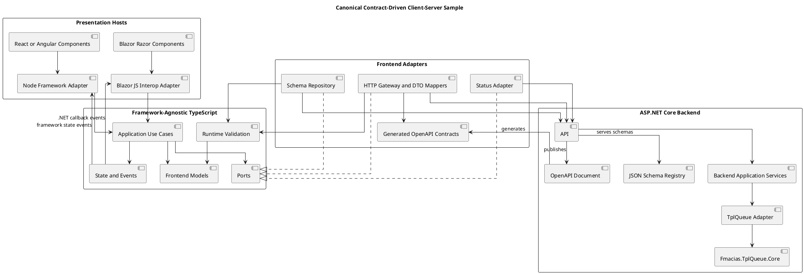
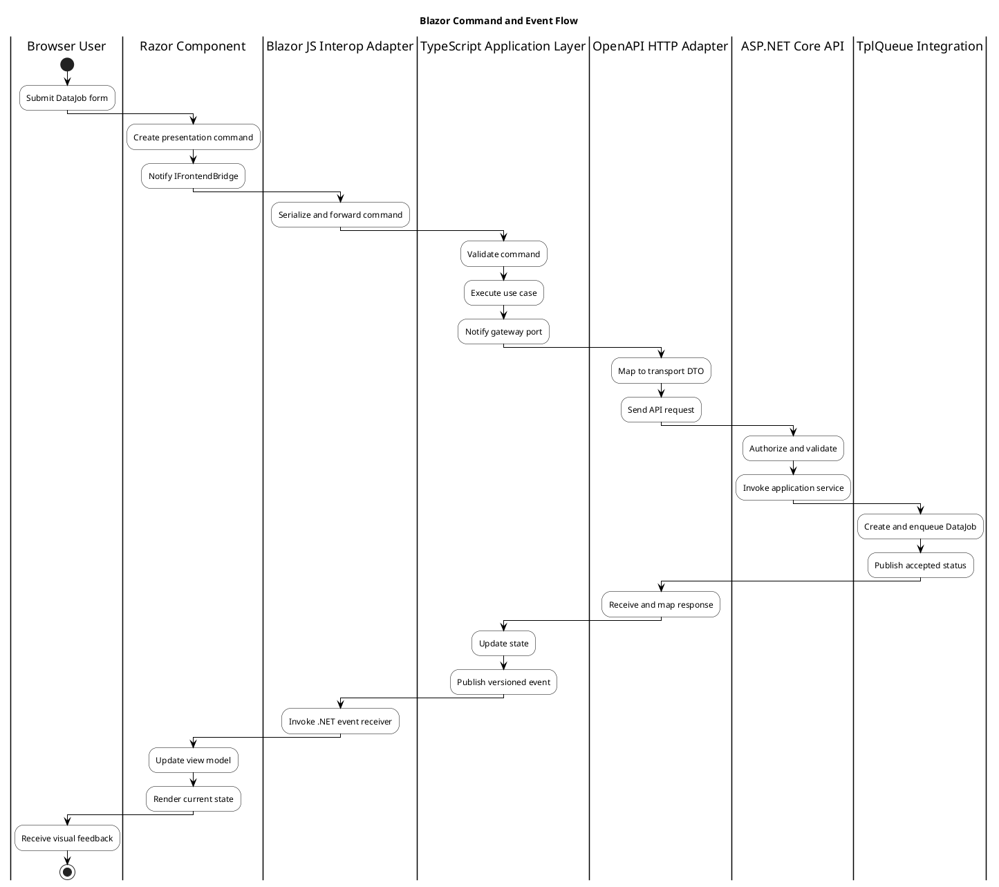

# AGENTS.md — Contract-Driven Client–Server Samples
## Context

You are working in the `TplQueue.Usage` repository.

This repository is the public package-consumption, sample, and validation surface for the TplQueue ecosystem.

It contains:

- runnable consumer samples
- package-based integration validation
- public-safe repository documentation under `docs/`

It does not own the private `TplQueue.Core` implementation documentation anymore. Private Core documentation now belongs in the private `TplQueue.Core` repository, while public TplQueue consumption documentation belongs in `TplQueue.Adapter/docs/<lang>/`.

Check the AGENTS_RULES.md which contains the refactor, review and implementation rules.

## Implementation Rules

Implementation rules to implement consumer example applications are found at user main folder ./.,/fmacias

## Repository boundaries

When working in this repository:

1. Treat it as a public-facing repository.
2. Prefer published-package consumption flows over private-source assumptions.
3. Do not reintroduce `TplQueue.Core` private documentation as public source-of-truth content here.
4. Keep runnable examples and validation flows aligned with the published packages and the current public documentation.

## Cross-repository documentation alignment

When a task touches documentation, navigation, publishing, licensing text, or repository-boundary explanations:

1. Read the root `Agents.md` or `AGENTS.md` and the root `README.md` of every directly affected repository before editing.
2. If a more specific instruction file exists for the affected surface, read it after the root files.
3. Compare the requested change against the current documented source-of-truth model and note any contradictions before applying broad edits.
4. Do not silently normalize contradictions across repositories.
5. If the human instruction conflicts with the existing documentation or instruction files and intent is not already explicit, ask whether to:
   - align the documentation to the current human instruction and treat the inconsistency as an exception, or
   - preserve the existing inconsistency as the current operating rule.
6. When proceeding with a cross-repository documentation change, update the relevant `README.md`, `Agents.md` or `AGENTS.md`, and sync or publishing instructions together so the documentation boundary remains aligned.
7. Apply the Review, implentation, refactor and test rules as decribed in Agents.md file of ..\TplQueue.Adapter\Agenst.md

## Public documentation boundary

- `TplQueue.Adapter/docs/<lang>/` is the public source of truth for the integrated TplQueue documentation.
- `TplQueue.Core/docs/<lang>/` is private Core documentation.
- `fmacias.github.io` publishes the public TplQueue documentation from `TplQueue.Adapter/docs/<lang>/`.
- `TplQueue.Usage` should link to those sources, samples, and public validation flows without duplicating private or deprecated documentation trees.

## Validation workflow

When changes are made, run the relevant public validation commands when possible:

1. `.\build.ps1`
2. `.\test.ps1`
3. `.\coverage.ps1`

If a step cannot be executed, state that clearly.

## 1. Mission

### Minimal Interactive Server dashboard profile

`samples/TplQueue.Sample.BlazorSignalR` is intentionally a minimal same-process
integration sample. Its Razor dashboard may call an injected presentation or
application service directly. It uses the built-in Blazor Interactive Server
SignalR circuit for observer-driven rendering. Backend queue selection,
handlers, payload construction, and job-graph topology must remain outside
Razor components.

Implement client–server sample applications using a stable, contract-driven architecture.

The default host profile for the current application is **Blazor**. Future sample hosts may use React or Angular. Host-specific rendering code must remain replaceable.

Every client–server sample must preserve these invariant layers:

```text
Presentation host
        ↓
Host presentation adapter
        ↓
Framework-agnostic TypeScript application layer
        ↓
Ports
        ↑
Generated OpenAPI transport and infrastructure adapters
        ↓
ASP.NET Core API
        ↓
Backend application services
        ↓
Optional TplQueue execution adapter
```

The frontend framework is a rendering and composition mechanism. It must not become the owner of transport contracts, DTO mapping, application policies, runtime schema validation, or backend execution decisions.

Read `docs/architecture/blazor-consumer-sample.md` or the equivalent architecture document before implementing or restructuring a sample.

---

## 2. Determine the Host Profile First

Before editing code, identify the active host profile.

### Blazor host indicators

- `.razor` files.
- A Blazor `.csproj`.
- `Components`, `Pages`, or `Layout` directories.
- `IJSRuntime`, `IJSObjectReference`, or `DotNetObjectReference`.
- A `blazor-interop` TypeScript package or ES-module facade.

### React host indicators

- React dependencies in `package.json`.
- `.tsx` components.
- React router or React application bootstrap code.

### Angular host indicators

- `angular.json`.
- Angular dependencies.
- Components, modules, or standalone Angular bootstrap files.

### Host rule

Use exactly one presentation host for a concrete sample unless the task explicitly requests two separate hosts.

Do not add React or Angular to a Blazor sample. Node tooling may be used to compile, test, and bundle the framework-agnostic TypeScript packages without introducing a Node framework at runtime.

---

## 3. Canonical Host Profiles

### Blazor

```text
Razor component
    ↓
Blazor presentation service / view model
    ↓
typed IFrontendBridge
    ↓
Blazor JavaScript interop facade
    ↓
framework-agnostic TypeScript use case
```

### React or Angular

```text
React or Angular component
    ↓
framework presentation adapter
    ↓ direct TypeScript call
framework-agnostic TypeScript use case
```

Both profiles reuse:

- Generated OpenAPI contracts.
- Frontend application models.
- Use cases.
- Ports.
- DTO mappers.
- Runtime schema validation.
- Event envelopes.
- Design tokens.

Do not fork or duplicate the common application layer for each host.

---

## 4. Canonical Component Architecture



---

## 5. Layer Ownership

### Backend domain

Owns:

- Business concepts.
- Invariants.
- Value objects.
- Execution-independent policies.

Must not depend on:

- ASP.NET Core endpoint code.
- API DTOs.
- TplQueue implementation types.
- Frontend projects.
- Blazor, React, or Angular.

### Backend application

Owns:

- Commands and queries.
- Use cases.
- Authorization-relevant application policies.
- Backend ports.
- Transaction boundaries.
- TplQueue-independent execution requests.

### TplQueue integration

Owns:

- Mapping application commands to TplQueue jobs.
- Queue selection.
- Retry-policy selection.
- Job graphs and dependencies.
- Observer registration.
- Status projection updates.
- Cancellation propagation.

Must not leak TplQueue implementation types into API DTOs.

### API contracts

Own:

- Request DTOs.
- Response DTOs.
- Error DTOs.
- Public event DTOs.
- OpenAPI metadata.
- JSON Schema response envelopes.

API contracts are not backend domain models.

### Framework-agnostic TypeScript core

Owns:

- Frontend application models.
- Use cases.
- Commands.
- Ports.
- State transitions.
- Runtime validation orchestration.
- Application events.

Must not import UI frameworks, Blazor-specific JavaScript, or DOM/storage APIs in core modules.

### Frontend infrastructure

Owns:

- Generated OpenAPI DTOs and client declarations.
- HTTP calls.
- DTO mappers.
- Browser cache implementations.
- Status polling or event subscriptions.
- Schema retrieval.

### Blazor presentation

Owns:

- Razor rendering.
- Input binding.
- Local edit view models.
- Accessibility.
- Navigation.
- Blazor lifecycle.
- Typed JS interop services.
- Receiving versioned frontend events.

Razor components must not directly call HTTP APIs or import generated TypeScript transport concepts.

---

## 6. OpenAPI and Generated Contracts

OpenAPI is the source of truth for fixed HTTP transport contracts.

### Required workflow

1. Define or update backend API DTOs.
2. Generate the OpenAPI document.
3. Regenerate the TypeScript transport package.
4. Review the generated contract diff.
5. Update handwritten DTO mappers.
6. Update contract tests.
7. Update architecture or API documentation.

### Generated-code rules

- Treat generated files as read-only.
- Never manually patch generated DTOs or clients.
- Keep generated code in a clearly named directory.
- Add a reproducible generation command to repository scripts.
- Fail CI when committed generated code differs from regenerated output, when practical.
- Do not import generated transport DTOs into Razor components.
- Do not use generated transport DTOs as frontend domain models.

### Contract compatibility

For public sample contracts:

- Additive optional fields are preferred.
- Renames and removals require a versioning decision.
- Enum expansion must be handled safely by clients.
- Dates, durations, identifiers, and nullable fields require explicit mapping.
- Error responses must be documented and typed.
- Do not expose CLR type names or TplQueue internal class names as public discriminators.

---

## 7. DTO and Model Boundaries

Use explicit mapping at every trust or architectural boundary.

```text
Backend domain
    ↓ mapper
API DTO
    ↓ serialization
Generated TypeScript DTO
    ↓ mapper and validation
Frontend application model
    ↓ event/view mapper
Blazor view model
```

### Rules

- Use `unknown` for untrusted TypeScript payloads.
- Validate before narrowing `unknown`.
- Do not use type assertions to bypass missing validation.
- Parse dates into application date representations explicitly.
- Parse identifiers into branded or validated identifiers where used.
- Parse finite statuses into discriminated unions.
- Preserve unknown future status values as diagnostics rather than crashing.
- Do not serialize backend exceptions to the browser.
- Keep UI text out of transport DTOs unless it is intentionally server-owned localized content.

---

## 8. Dynamic JSON Schema Contracts

Use JSON Schema for runtime DataJob payload structure.

Each schema response must contain:

- `schemaId`.
- `schemaVersion`.
- JSON Schema dialect.
- JSON Schema document.
- Separate UI metadata.
- Cache metadata such as ETag or checksum.
- Optional server-provided capabilities.

### Rules

- Never download or execute arbitrary JavaScript or TypeScript.
- Validate schema metadata before caching.
- Cache by schema ID, version, and validation metadata.
- The backend is always the final validator.
- Submit the schema ID and version with every payload.
- Reject or diagnose unsupported schema constructs explicitly.
- Keep authorization decisions on the server.
- Do not store secrets in schema defaults or UI metadata.
- Do not assume a cached schema grants authorization to use a job type.

---

## 9. Framework-Agnostic TypeScript Rules

Enable strict TypeScript checking.

Prefer:

- `unknown` over `any`.
- Readonly data.
- Immutable state transitions.
- Discriminated unions.
- Small pure mapping functions.
- Explicit commands and events.
- Ports and adapters.
- Composition over inheritance.
- Feature public APIs through `index.ts`.

The core package must not reference:

```text
react
@angular/*
IJSRuntime
DotNetObjectReference
window
document
localStorage
IndexedDB
fetch
framework routers
framework state libraries
```

`fetch`, browser storage, event channels, and DOM APIs are permitted only in infrastructure or host adapter packages.

Do not introduce a global store unless several independent features require shared application state.

---

## 10. Blazor-Specific Rules

The default host profile is Blazor.

### Razor component responsibilities

Razor components may:

- Render state.
- Bind user input.
- Manage focus and local editing details.
- Raise presentation commands.
- Display validation and operation results.
- Compose reusable Razor components.

Razor components must not:

- Call backend endpoints directly.
- Instantiate `HttpClient` for feature operations.
- Know generated TypeScript DTO shapes.
- Implement DTO mapping.
- Contain queue-selection or retry-policy logic.
- Parse arbitrary backend JSON.
- Own application state transition rules.
- Call TplQueue directly.
- Execute JavaScript received from a server.

### Presentation services

Use presentation services or view models between components and the JS bridge.

Prefer one feature facade over many low-level interop calls.

```csharp
public interface IFrontendBridge : IAsyncDisposable
{
    event EventHandler<FrontendEventReceivedEventArgs>? EventReceived;

    ValueTask InitializeAsync(
        CancellationToken cancellationToken = default);

    ValueTask ExecuteAsync<TCommand>(
        string commandType,
        TCommand command,
        CancellationToken cancellationToken = default);
}
```

A concrete application may expose named methods instead of a generic method when that improves type safety.

### Lifecycle

- Import ES modules lazily or through a scoped bridge service.
- Register one .NET event receiver per bridge instance.
- Dispose `IJSObjectReference`.
- Dispose `DotNetObjectReference`.
- Unsubscribe JavaScript listeners.
- Stop polling or event subscriptions on navigation/disposal.
- Propagate cancellation when a component is disposed.
- Use the Blazor synchronization context when callbacks update component state.
- Do not call `StateHasChanged` from an arbitrary JavaScript callback thread without using the appropriate Blazor invocation mechanism.

### Interop granularity

Prefer:

```text
loadDataJobTypes
loadPayloadSchema
submitDataJob
startJobStatusSubscription
cancelDataJob
dispose
```

Avoid exposing internal mapper, reducer, or gateway methods individually.

### Interop data

Only pass:

- JSON-serializable commands.
- JSON-serializable results.
- Versioned event envelopes.
- Stable identifiers.
- Explicit contract versions.

Do not pass DOM elements, framework objects, TplQueue instances, delegates, or unbounded object graphs across the boundary.

---

## 11. Blazor Event Flow



---

## 12. Frontend Events and State

Use versioned frontend event envelopes.

Required envelope properties:

```text
contractVersion
eventId
eventType
occurredAt
correlationId
payload
```

### Event rules

- Event names describe facts, not UI methods.
- Prefer `data-job-accepted` over `set-job-card`.
- Events contain stable application data, not DOM instructions.
- The TypeScript common layer publishes state snapshots or application events.
- The Blazor adapter maps these into .NET event records.
- Unknown event types are logged and ignored safely.
- Contract-version incompatibility produces an explicit diagnostic.
- Duplicate event IDs must not cause duplicate irreversible UI actions.
- Correlation IDs must flow end to end.

### State rules

Separate:

- Server state.
- Frontend application state.
- Blazor local edit state.
- Local visual state.
- Persisted browser preferences.

The TypeScript common layer owns application workflow transitions.

Blazor owns local form editing and rendering state.

Do not model the workflow as unrelated Boolean flags such as:

```text
isLoading
isSubmitting
isComplete
hasError
isCancelled
```

when those flags can create impossible combinations. Prefer a finite state model or discriminated union.

---

## 13. TplQueue Integration Rules

TplQueue runs on the backend.

### Required boundaries

- Backend application services invoke an application port.
- A TplQueue adapter implements that port.
- DataJob factories create immutable job input.
- Handlers execute integration work.
- Retry and queue policies are backend configuration.
- Observers publish execution facts to a status projection.
- The API exposes stable status DTOs.
- The frontend never receives a TplQueue object.

### Status flow

```text
TplQueue execution notification
    ↓
observer
    ↓
idempotent status projection
    ↓
status API or event channel
    ↓
frontend status adapter
    ↓
application state event
    ↓
Blazor rendering
```

### Reliability

- Propagate cancellation tokens.
- Bound concurrency explicitly.
- Document FIFO versus parallel behavior.
- Keep observer work non-blocking.
- Isolate observer failures.
- Record failure categories without exposing sensitive exception details.
- Make status projection updates idempotent.
- Preserve correlation and job IDs.
- Do not claim distributed durability unless a durable external mechanism actually provides it.

TplQueue is not automatically a distributed message broker or durable cross-process event bus.

---

## 14. Backend API Rules

The initial DataJob sample may expose:

```text
GET  /api/data-job-types
GET  /api/data-job-types/{type}/payload-schema
POST /api/data-jobs
GET  /api/data-jobs/{jobId}
POST /api/data-jobs/{jobId}/cancel
```

### API requirements

- Authenticate before returning protected schemas.
- Authorize each job type.
- Validate DTOs.
- Validate schema ID and version.
- Validate the payload against the authoritative schema.
- Return stable problem details for failures.
- Return `202 Accepted` for asynchronous creation where appropriate.
- Return a stable job ID and status resource location.
- Do not expose implementation stack traces.
- Document cancellation semantics.
- Document idempotency behavior.
- Document status values.
- Define how expired or unknown job IDs are represented.

---

## 15. Design System and UX Rules

Use:

```text
Design tokens
    ↓
primitives
    ↓
reusable components
    ↓
interaction patterns
    ↓
feature components
    ↓
pages
```

### Shared tokens

Tokens must be consumable by Blazor and Node-based hosts.

Prefer CSS custom properties for runtime presentation:

```css
:root {
  --color-surface-default: #fff;
  --color-text-primary: #171717;
  --space-container-medium: 1rem;
  --radius-control: 0.375rem;
}
```

Do not introduce arbitrary raw visual values in feature components when a token exists.

### Required feature states

Implement applicable states:

- Initial.
- Loading.
- Empty.
- Editing.
- Validation error.
- Submitting.
- Queued.
- Running.
- Completed.
- Failed.
- Cancelled.
- Forbidden.
- Disabled.

### Accessibility

- Use semantic HTML.
- Associate labels and controls programmatically.
- Make all interactions keyboard accessible.
- Expose validation errors clearly.
- Announce asynchronous status changes where appropriate.
- Preserve focus after validation and navigation changes.
- Do not use color as the only status indicator.

### Component catalogues

For Blazor:

- Maintain a Razor component showcase or development page.
- Add component tests for all meaningful states.

For React, Angular, or Web Components:

- Maintain Storybook stories for all meaningful states.

Figma represents design intent. Implemented components and tests represent executable behavior.

---

## 16. MCP and Codex Workflow

MCP sources provide engineering context. They do not define the architecture.

Use available MCP sources to retrieve:

- Figma frame and component context.
- Repository and issue context.
- OpenAPI documentation.
- Architecture documents.
- Change-request requirements.
- Integration or equipment documentation.
- Existing component definitions.

Always combine MCP context with:

- This `AGENTS.md`.
- Repository architecture.
- Existing tests.
- OpenAPI contracts.
- Design tokens.
- Acceptance criteria.

### Figma task workflow

When a Figma reference is supplied:

1. Inspect the referenced frame through the configured MCP integration.
2. Identify components, variables, variants, responsive behavior, and states.
3. Find existing design tokens.
4. Find existing Razor or Storybook components.
5. Reuse existing components before creating new ones.
6. Do not copy absolute positioning blindly.
7. Preserve semantic HTML and accessibility.
8. Document deliberate implementation differences.

---

## 17. Feature Implementation Workflow

For every client–server feature:

1. Read the applicable `AGENTS.md` files.
2. Identify the active host profile.
3. Read the architecture document and relevant ADRs.
4. Identify the user use case and acceptance criteria.
5. Identify backend domain and application changes.
6. Define or update API DTOs.
7. Regenerate OpenAPI contracts.
8. Add or update frontend application models and ports.
9. Implement DTO mappings.
10. Implement backend and frontend validation.
11. Implement or update TplQueue integration only when asynchronous execution is required.
12. Implement the host adapter.
13. Implement the presentation.
14. Add loading, empty, error, forbidden, and success states.
15. Add tests at each changed boundary.
16. Update PlantUML and contract documentation.
17. Run all repository verification commands.
18. Review the diff for boundary violations.

Do not begin by generating a page directly from a design while ignoring contracts and use cases.

---

## 18. Testing Requirements

### Backend

Test:

- Domain invariants.
- Application use cases.
- Authorization-relevant behavior.
- API DTO validation.
- OpenAPI contract behavior.
- JSON Schema validation.
- TplQueue job creation.
- Queue behavior.
- Retry behavior.
- Cancellation.
- Observer isolation.
- Status projection idempotency.

### TypeScript

Test:

- DTO mappers.
- Unknown and malformed input.
- Application state transitions.
- Event envelope compatibility.
- Schema cache keys.
- HTTP errors.
- Cancellation and disposal.
- Unknown future enum/status values.

### Blazor

Test:

- Component rendering.
- User commands.
- Validation messages.
- All required presentation states.
- JS bridge calls.
- .NET callback handling.
- Disposal.
- Navigation during active operations.
- Accessibility.

### End-to-end

Include at least one complete successful DataJob flow and one failure flow.

Do not replace boundary tests with only a screenshot or visual review.

---

## 19. Verification Commands

Discover and use the repository-defined commands. Do not invent a parallel toolchain when scripts already exist.

Expected categories include:

```text
dotnet format or repository formatting command
dotnet build
dotnet test
OpenAPI generation or verification
npm/pnpm/yarn install using the repository lockfile
frontend format check
frontend lint
TypeScript type check
frontend unit tests
frontend production build
PlantUML rendering or syntax verification when tooling exists
```

### Lockfiles

- Use the package manager selected by the committed lockfile.
- Do not generate a second lockfile.
- Do not upgrade dependencies unless required by the task.
- Explain any added production dependency.

### Failure reporting

If a verification command cannot run:

- State the exact command.
- State the failure.
- Distinguish repository defects from environment limitations.
- Do not report a check as passed when it was not executed.

---

## 20. Definition of Done

A feature is complete only when:

- The use case and acceptance criteria are implemented.
- Backend domain models are not exposed as DTOs.
- OpenAPI contracts are current.
- Generated transport code is current and unmodified by hand.
- DTO mappings are explicit.
- The TypeScript common layer remains framework-agnostic.
- Razor components contain no direct HTTP implementation.
- Blazor interop contracts are versioned and serializable.
- Interop resources and subscriptions are disposed.
- Dynamic payloads are validated on client and server.
- TplQueue remains behind the backend application boundary.
- Job status is exposed through a stable projection.
- Required UI states are implemented.
- Accessibility requirements are met.
- Tests cover changed boundaries.
- Architecture documentation and diagrams are updated.
- Builds and verification commands pass, or failures are explicitly reported.

---

## 21. Prohibited Patterns

Do not:

- Hand-edit generated OpenAPI clients.
- Serialize backend domain entities directly.
- Expose TplQueue implementation objects through HTTP.
- Call backend endpoints directly from Razor components.
- Put application policies in Razor event handlers.
- Import Blazor, React, Angular, or DOM APIs into the TypeScript core.
- Treat client-side validation as a security boundary.
- Execute code downloaded with a dynamic schema.
- Place secrets in frontend code, schemas, defaults, or committed environment files.
- Trust authorization claims sent by the client.
- Use unversioned JS interop event payloads.
- Create one interop call for every field keystroke without a measured requirement.
- Leak `DotNetObjectReference` or `IJSObjectReference`.
- Introduce React or Angular into a Blazor sample.
- Duplicate the common TypeScript application layer for another host.
- Add microfrontends without an independent deployment requirement.
- Add a distributed broker merely to simulate in-process TplQueue events.
- Claim exactly-once or distributed durability without an actual mechanism.
- Ignore unknown DTO fields, statuses, or schema features silently.
- Create UI-only happy paths without loading, validation, and failure states.

---

## 22. Change Review Checklist

Before finalizing a change, inspect the diff for:

```text
[ ] Generated files edited manually
[ ] Transport DTOs imported into Razor presentation
[ ] Direct HttpClient calls from components
[ ] Framework imports in frontend-core
[ ] Missing DTO mapping
[ ] Missing runtime validation
[ ] Missing server validation
[ ] Missing cancellation propagation
[ ] Missing correlation IDs
[ ] TplQueue types exposed through contracts
[ ] Observer work blocking queue execution
[ ] Missing interop disposal
[ ] Unversioned events
[ ] Raw visual values instead of tokens
[ ] Missing UI states
[ ] Missing accessibility labels or keyboard operation
[ ] Missing contract, component, or integration tests
[ ] Architecture diagrams no longer matching implementation
```

Correct boundary violations before adding further feature code.
