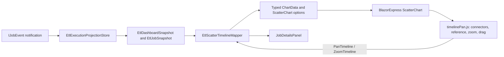

> Historical record, superseded by the [current JobMonitor architecture](blazor-consumer-sample.md). The implementation and validation statements below describe the earlier ScatterChart iteration.

# Historical ScatterChart implementation snapshot

Reviewed on 2026-09-15. This document describes the implementation currently
present in `TplQueue.Sample.BlazorSignalR`, the reason for the main design
choices, and the work that remains before the sample can be treated as a fully
validated reference application.

## Purpose and scope

The sample is a .NET 8 Blazor Interactive Server dashboard for the ETL workload
in `TplQueue.Sample.Etl`. It is an observation surface: TplQueue owns queue
execution, payloads, retries, and dependency semantics; the dashboard projects
observer messages into readable presentation state and renders that state in a
browser.

The sample is intentionally smaller than a workflow designer. It does not
edit jobs, control execution, infer dependencies from display names, or expose
live payload objects to the browser. The main user task is:

```text
observe → hover to identify → click to select → inspect details
```

The runnable project is:

`C:\Users\Fernando\source\fmacias\TplQueue.Usage\samples\TplQueue.Sample.BlazorSignalR\TplQueue.Sample.BlazorSignalR.csproj`

The maintained architecture and contract guide is
[`blazor-consumer-sample.md`](blazor-consumer-sample.md). This document is the
more concrete status report for the current ScatterChart implementation.

## Current technology decisions

The sample uses:

- Blazor Interactive Server on .NET 8.
- The existing ASP.NET Core circuit for browser updates; no second dashboard
  SignalR hub is introduced.
- `BlazorExpress.ChartJS` `ScatterChart` for the execution plot.
- Blazor Bootstrap and ordinary HTML/CSS for cards, filters, details, and the
  collapsible summary panel.
- Handwritten C# records and mapper code for the current presentation boundary.
- One small JavaScript module for Chart.js scale decorations, connectors,
  dragging, and mouse-wheel zoom.

TypeScript DTOs are not required for this Blazor profile. The C# records are
the readable application boundary here. A future Angular, Node.js, or other
TypeScript sample can consume a separately generated contract; that future
contract should not force this Blazor application to move its local state and
mapping logic into JavaScript.

The frontend is divided into two review categories:

| Area | Current ownership | Review expectation |
| --- | --- | --- |
| TplQueue observer and ETL execution | TplQueue and `TplQueue.Sample.Etl` | Human-reviewed domain and execution behavior |
| Observer projection | `EtlExecutionProjectionStore.cs` | Human-reviewed mapping and lifecycle rules |
| Dashboard snapshot records | `EtlDashboardSnapshot.cs` | Human-readable C# presentation DTOs |
| Timeline layout | `ScatterTimeline.cs` | Human-reviewed deterministic layout rules |
| Razor page and details panel | `Dashboard.razor`, `JobDetailsPanel.razor` | Human-reviewed UI and data flow |
| Chart decorations and input adapter | `wwwroot/js/timelinePan.js` | Small, isolated JavaScript integration |
| Future cross-frontend contract | Not implemented in this sample | Candidate for generated TypeScript/C# artifacts later |

## Data flow

The intended flow is explicit and short:



`EtlExecutionProjectionStore.Changed` schedules a component refresh through
Blazor's synchronization context. The page rebuilds typed datasets and calls
`ScatterChart.UpdateAsync` on the existing chart instance. The JavaScript
adapter is then given the latest point coordinates and dependency endpoints so
its decorations follow the same scale after every update.

## Observer projection and dependency information

`EtlExecutionProjectionStore` is a singleton projection owned by the sample.
It consumes `IJobEvent` values and keeps a thread-safe, idempotent dictionary of
jobs. Its current behavior is:

1. Reject an event without job metadata.
2. Resolve the queue descriptor from `CrossQueueId`.
3. Ignore duplicate event fingerprints.
4. Capture direct dependency IDs from `IJobInfo.Dependencies`.
5. Apply lifecycle timestamps and a monotonic status rank.
6. Preserve a bounded one-line error summary.
7. On a root-success event, recursively materialize the dependency graph and
   assign the root ID to every known dependency.
8. Notify the dashboard after the projection lock is released.

The dependency direction is explicit:

```text
IJobInfo.Dependencies belongs to the dependent job

dependency A  ───────────────▶  dependent B
```

The visual connector is drawn from A to B. The first version does not use
arrowheads because time increases from left to right and the endpoint order is
already supplied by the dependency relationship.

The snapshot contains stable IDs, queue identity, state, lifecycle timestamps,
retry count, error summary, latest accepted event type, latest accepted event
timestamp, root ID, and direct dependency IDs. It does not send live queue
objects, arbitrary payload graphs, or a reflection-based property bag to the
browser.

## Timeline coordinate model

### X coordinate

Each interactive page captures one reference timestamp when it initializes.
The default visible range is:

```text
past:   -10,000 ms
future: +10,000 ms
tick:       500 ms
```

For a job event:

```text
DisplayedX = (ActualTimestamp - ReferenceTimestamp).TotalMilliseconds
```

`ActualTimestamp` remains in the point metadata. The mapper does not move a
point horizontally to avoid collisions, because doing so would fabricate a
time difference and make dependency timing harder to trust.

Chart.js uses a 500 ms source step, rotates labels slightly, and auto-skips
labels when the available width cannot hold them comfortably. This keeps the
time scale precise without turning the bottom axis into a dense block of text.
The reference marker is separate: a thin vertical line is drawn at `X = 0`,
and the reference datetime is drawn horizontally below the plot with its right
edge aligned immediately to the left of the zero line.

Dragging the chart changes the reference timestamp while keeping the window
width. Dragging right exposes older data; dragging left exposes newer data.
The observer refresh interval does not move the reference automatically.

Zooming changes the past and future window symmetrically. It does not change the
reference timestamp or the source event timestamp. The page provides Zoom In,
Zoom Out, Reset, and mouse-wheel zoom over the chart. The current window is
bounded between 1 second and 120 seconds on each side.

### Y coordinate and queue bands

The Y axis is numeric internally but its tick labels are hidden. Selected queues
are assigned stable visual bands. Queue names remain in the queue filter and
the collapsed summary panel so they do not consume plot width.

The layout first identifies every visible root sequence. A sequence that crosses
queue bands receives a deterministic shared row index. A sequence that exists in
only one queue is assigned a compact queue-local row, so independent workloads
do not create empty rows in unrelated bands. The sequence key is:

```text
RootJobId when known
otherwise the job's own JobId
```

The shared row index is used inside every queue band that contains that sequence.
This means jobs from one root sequence line up across ParallelQ, FifoQ, and
CacheQ while each point still remains inside the band for its actual queue.
Queue-local sequences are packed after shared rows.

Within one queue and one root row, genuinely parallel points use bounded
vertical slots in this order:

```text
0, -1, +1, -2, +2, ...
```

Sequential points in the same root row keep the same Y coordinate. The queue
band grows when more parallel slots are needed. The row capacity is shared by
the selected bands so the same root row remains aligned across queues.

Visual constants are named in `EtlScatterTimelineMapper`:

| Constant | Current value | Meaning |
| --- | ---: | --- |
| `PreferredPointDiameter` | 16 px | Normal point diameter |
| `MinimumPointDiameter` | 14 px | Interaction-safe minimum |
| `MinimumGap` | 4 px | Gap between nearby point footprints |
| `MinimumPointSpacing` | 20 px | Diameter plus gap |
| `PlotWidthPixels` | 850 px | Layout conversion width |
| `SequenceRowGap` | 1 Y unit | Separation between root rows |
| `MinimumChartHeight` | 460 px | Smallest chart surface |

## Chart rendering and connectors

Each job is one `ScatterChartDataset` containing one point. The dataset label
contains the compact hover information: name, ID, queue, state, event type, and
timestamp. State controls point color. Selection changes the border and radius
without changing the point coordinate.

The installed ChartJS wrapper exposes the scatter point datasets but does not
provide the small line-connection behavior needed by this sample. The isolated
plugin in `wwwroot/js/timelinePan.js` therefore:

- obtains the retained chart instance;
- sets the linear X tick step and label rotation;
- draws the exact reference line using `scales.x.getPixelForValue(0)`;
- draws dependency connectors using both X and Y scale conversions;
- draws the horizontal reference datetime label;
- handles pointer drag for time-slice movement; and
- handles mouse-wheel zoom.

Connectors are drawn before the point datasets, so the circles remain the
interactive foreground objects. The plugin receives point coordinates from the
same `EtlScatterTimeline` result used to build the datasets; it does not repeat
layout calculations in JavaScript.

ScatterChart remains the appropriate chart type. A line chart is optimized for
ordered datasets where the line is the primary series. This dashboard needs
independent numeric X/Y positions, multiple queue bands, one selectable dataset
per job, and cross-queue dependency segments. ScatterChart plus a small scale
plugin keeps those responsibilities explicit.

## Current page structure

The first screen prioritizes the timeline:

```text
┌─────────────────────────────────────────────────────────────────────────────┐
│ Compact title                                                               │
├─────────────────────────────────────────────────────────────────────────────┤
│ Timeline toolbar, reference, filters, zoom                                  │
│ ParallelQ / FifoQ / CacheQ bands with root sequence rows                     │
│                                                                             │
│ Full-width, full-height primary chart                                       │
├─────────────────────────────────────────────────────────────────────────────┤
│ Selected job details                                                        │
├─────────────────────────────────────────────────────────────────────────────┤
│ ▸ Queue summaries (collapsed)                                               │
└─────────────────────────────────────────────────────────────────────────────┘
```

The timeline is the primary surface at every width. It occupies the full
available page width and receives the largest vertical area, while the heading
is intentionally compact. The selected-job panel is a secondary full-width
section below the chart, and queue summaries stay collapsed below that. This
keeps controls and inspection available without competing with the execution
geometry.

Supported interactions are:

- Queue checkboxes show all, one, or two queue bands. The last selected queue
  cannot be unchecked, so the chart never becomes context-free.
- Hover identifies a point through the Chart.js tooltip.
- Click selects a job and keeps the selection in the details panel.
- Drag moves the fixed reference through the retained projection.
- Zoom In, Zoom Out, mouse-wheel zoom, and Reset change the visible time slice.
- Observer notifications update the affected chart state without changing the
  reference timestamp.
- The collapsed Queue summaries panel provides totals, running, completed, and
  failed counts when those values are needed.

### UX review decisions

The current hierarchy deliberately gives the chart the first and largest visual
weight:

- The heading contains only the product view name and a small live-observer
  status. A descriptive paragraph would push the execution surface down without
  helping a returning operator.
- The chart card spans the available viewport width. Queue names are available
  in the checkbox filter and details, while the plot keeps its horizontal space
  for time and dependency geometry.
- The chart height is fitted after render to the available viewport space and is
  recalculated on browser resize. The mapper still supplies a natural height for
  dense workloads, while the current ETL sample fits its complete graph without
  an internal vertical scrollbar.
- Details are below the chart so selection never shrinks the coordinate space or
  causes points and connectors to reflow. The empty state remains useful but
  visually quiet until a point is selected.
- Queue totals are behind a collapsed disclosure. They remain available for
  orientation but cannot compete with the timeline on first load.
- The fixed reference line and timestamp are separate from the job points. The
  reference label is horizontal and placed below zero; x-axis labels are allowed
  to auto-skip when the viewport is too narrow. This avoids making the time axis
  look like a second block of unreadable metadata.

The remaining browser-level UX limitation is inherent to the current chart
wrapper: point selection is mouse/touch-oriented and does not yet expose a
keyboard list of jobs. The details panel remains the stable place for the full
selected-job content; adding a separate accessible job list can be considered
when the sample gains a larger history or an observer log.

## Source map

| File | Responsibility |
| --- | --- |
| `Presentation/Etl/EtlExecutionProjectionStore.cs` | Idempotent observer projection, lifecycle state, root/dependency capture |
| `Presentation/Etl/EtlDashboardSnapshot.cs` | Readable queue and job snapshot records |
| `Presentation/Etl/ScatterTimeline.cs` | Root rows, queue bands, signed X values, parallel offsets, connector IDs |
| `Components/Pages/Dashboard.razor` | Page composition, chart options, filters, zoom, reference and selection state |
| `Components/Pages/JobDetailsPanel.razor` | Persistent selected-job inspection |
| `wwwroot/js/timelinePan.js` | Chart scale decoration, connectors, reference marker, drag, wheel zoom |
| `wwwroot/app.css` | Timeline-first responsive layout and secondary summary panel |
| `test/integration/.../EtlExecutionProjectionStoreTests.cs` | Projection, dependency, and root-row alignment checks |
| `README.md` | Sample-level usage notes |

The intended ownership remains visible in the source:

```text
observer event
    ↓
projection store
    ↓
snapshot records
    ↓
timeline mapper
    ↓
ScatterChart datasets/options
    ↓
Chart.js scale plugin
    ↓
hover, selection, details, drag, zoom
```

## Validation status

Completed checks:

- `node --check samples/TplQueue.Sample.BlazorSignalR/wwwroot/js/timelinePan.js`
- `git diff --check` for the sample, documentation, and integration test files.
- Added an integration test asserting that two root sequences keep the same row
  relationship across ParallelQ and FifoQ.

The normal project build could not complete because the active Visual Studio
debug/build process holds the sample's intermediate files, including:

```text
obj\Debug\net8.0\rpswa.dswa.cache.json
obj\Debug\net8.0\TplQueue.Sample.BlazorSignalR.GeneratedMSBuildEditorConfig.editorconfig
```

This is an environment lock rather than a reported C# compiler error. Stop or
restart the active debug session, then run the focused build and integration
tests before committing the changes. The running browser can also continue to
serve the previously compiled assembly until that rebuild occurs.

## Known boundaries and next steps

The current implementation intentionally leaves these items for later:

1. The observer refresh interval is still owned by the application/runtime; the
   dashboard reacts to notifications but does not introduce a second polling
   protocol.
2. Full observer history, large payload JSON, complete exception details, and
   a diagnostic log are not part of the normal point tooltip.
3. Connectors are rendered when both endpoints are inside the current visible
   slice. Dragging or zooming is used to inspect another slice.
4. Root grouping becomes complete when the root metadata has been observed. A
   dependency seen before its root event can temporarily appear under its own
   sequence key and is regrouped after the root event arrives.
5. The current sample has handwritten C# records. A generated TypeScript
   contract is a separate future consumer concern.
6. The dashboard is observational. It is not a graph editor, workflow designer,
   force-directed graph, or generic Chart.js wrapper.

The next useful validation is a live browser check after rebuilding Visual
Studio: verify that two related jobs in different queues occupy matching root
rows, that their connector follows the circles after zoom, and that the
reference timestamp remains fixed during observer updates and changes only
after drag.
