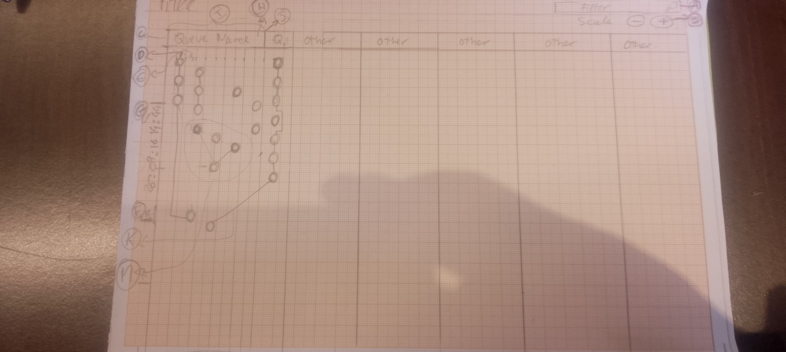

# TplQueue Job Monitor — Adopted frontend design and maintenance instructions

This document records the implemented design as of September 22, 2026, including
the decisions reached after the original sketch. The baseline is Usage commits
`ac680c2` and `931d6f0`. Earlier alternatives below are history, not instructions
to implement them again.

Use this file for frontend intent and geometry, [INTEGRATION.md](INTEGRATION.md)
for Blazor integration, and [README.md](README.md) for the API and quick start.
The maintained [sample architecture guide](../../docs/architecture/blazor-consumer-sample.md)
owns overall host architecture and repository boundaries. Read applicable
`AGENTS.md` files before editing. [FIXES_2026-09-17.md](FIXES_2026-09-17.md) is
historical evidence, not the current specification or current test results.

## 1. Purpose and adopted decisions

The monitor is a passive queue execution timeline for an industrial diagnostic
viewer. Save space while keeping positions, states and interactions readable,
including for people with reduced vision. The available area belongs to the
viewer; there is no permanent job details panel. A temporary inspection list is
allowed when the user opens a group of dense events.



The sketch records intent, not final geometry. These decisions replace the
corresponding original requirements:

| Earlier idea | Adopted behavior and reason |
| --- | --- |
| Refresh live view every 250 ms | Advance on incoming snapshots; stay idle between events. User input and resizing still redraw locally. |
| Circular jobs | A small square locates the exact timestamp; a larger outline and state symbol provide a readable target. |
| Reference near the vertical center | A five-second overview ends at the bottom reference. Older events are above it. |
| Fixed four pixels per millisecond | Resolution comes from plot height and visible interval. Five seconds cannot guarantee a separate pixel for every millisecond. |
| Displace close jobs to prevent overlap | Preserve timestamp centers; replace colliding markers with a count and their actual time range. |
| Zoom changes time and channel spacing | Zoom changes time only. Channel widths remain compact and independently resizable. |
| Known channel with first-observation time | Assigned placement requires the backend channel-bearing Started time; enqueue time remains metadata. |
| Choose whether to hide waiting jobs | Show them in a separate collapsible U strip, with Unassigned in tooltip and accessible name. |
| Wide expanded Unassigned header | Keep U in both states; reduce the default expanded strip from 104 to 40 pixels. |
| Bend or route dependency vectors | Use straight segments between visible representatives. Crossing avoidance and intermediate routing elements are not implemented. |

## 2. Component boundaries

The standalone demo and Blazor use the same dependency-free ES module source.
Do not introduce a second renderer or move queue behavior into JavaScript.

| Source | Responsibility |
| --- | --- |
| [src/model.js](src/model.js) | Validate/detach snapshots; normalize state and bound text/metadata. |
| [src/graph.js](src/graph.js) | Search and traverse explicit dependency relationships. |
| [src/config.js](src/config.js) | Defaults and minimum geometry constraints. |
| [src/layout.js](src/layout.js) | Coordinates, ticks, groups, queue widths and edge paths. |
| [src/job-queue-timeline.js](src/job-queue-timeline.js) | Time, selection, input, expansion, redraw scheduling and lifecycle. |
| [src/template.js](src/template.js), [src/styles.css](src/styles.css) | Controls and centralized theme tokens. |
| [src/renderer/svg-renderer.js](src/renderer/svg-renderer.js) | SVG from prepared geometry and accessible labels. |
| [integrations/blazor/job-monitor.js](integrations/blazor/job-monitor.js) | Selection callback and snapshot bridge. |

Keep business rules and geometry out of the mechanical renderer. Renderer edits
are appropriate for SVG elements and accessibility attributes. The current small,
flat module structure is intentional; no directory reorganization is needed.

## 3. Channels represent backend facts

For `maxParallelism = N`, draw exactly N numbered channels, `0..N-1`. A channel
is queue-local capacity held by an execution, not an OS thread, Task ID, root
family, job hash or frontend assignment. Capacity ownership can include dependency
waiting and retry delays; it does not measure CPU use.

Queue-managed executions cannot concurrently own the same channel in one queue.
The optional `IJobExecutionEvent : IJobEvent` contract carries the captured channel;
existing IJobEvent implementations remain valid. Terminal events retain their
captured identity after capacity release. Preserve runtime scheduling semantics.

The sample assigns a visual channel only when both `ExecutionChannel` and
`ChannelStartedAt` are known. The latter comes from a channel-bearing `Started`
event. Running or terminal observations cannot substitute their timestamps.
Until the pair is known, render `channel: null`, even if the lifecycle state is
running or completed. Unassigned can mean missing observation data, not only waiting.

On assignment, update the same job ID and place its execution marker at the actual
channel/start time. Retain its recorded `enqueuedAt` marker in U and connect the
two positions with a dashed arrow toward Started. This supersedes the earlier
move-only behavior at the user's request. The history marker is not a second job:
selection callbacks and job counts retain one identity. Root identity only describes
graph membership; `dependsOn` creates job-to-job connectors. Enqueue-to-start
connectors relate positions of the same job and do not change dependency traversal.
Projection and late-event rules are detailed in INTEGRATION.md.

## 4. Exact positions and the five-second window

Time increases downward. The default visible interval is inclusive:

```text
startTime = referenceTime - visibleWindowMs
visibleWindowMs = windowMs / scale
pixelsPerMs = (referenceY - plotTop) / visibleWindowMs
y = referenceY + (jobTime - referenceTime) * pixelsPerMs
```

Defaults are `windowMs = 5000`, `scale = 1`, `plotTop = 74`, and
`referenceY = layoutHeight - 20`. Plot top includes the 56-pixel header and
clearance for count markers. Layout height has a 240-pixel minimum. Jobs outside
the interval stay in the model but have no visible markers.

The square center is the job's exact position on its time axis and channel.
Keep fractional coordinates; never round timestamps to grid lines or offset jobs
to make room. JavaScript parses timestamps to milliseconds; finer backend
precision is not independently plotted. CSS and physical display pixels also differ.

The discussed four-pixels-per-millisecond scale can occur at a suitable zoom and
height, but is not a universal scale or a four-pixel duration block. Square size
denotes a position marker, not job duration. Duration appears in metadata; this
view is not a duration-bar or occupancy chart.

The fixed left UTC ruler remains visible during horizontal scrolling. Tick spacing
uses 1/2/5/10-based intervals targeting about 48 pixels between labels; 500 ms is
common in a tall five-second overview, not mandatory. Hover, keyboard focus and
selection align the job center with its channel and exact UTC ruler label.

## 5. Compact spacing and readable targets

Defaults are CSS pixels unless a time unit is given:

| Setting | Default | Meaning |
| --- | --- | --- |
| `minMarkerSize` / `maxMarkerSize` | 2 / 12 | Position square side grows as `min(12, 2 * scale)` at defaults. |
| `targetSize` | 24 | Larger job outline and interaction target. |
| `clusterSize` | 28 | Count marker size. |
| `markerGap` | 8 | Gap used for grouping and channel minimums. |
| `channelWidth` / `minChannelWidth` | 40 / 40 | Default assigned-channel pitch, independent of time zoom. |
| `queuePadding` | 8 | Each side of the assigned region. |
| `gutter` | 124 | Fixed left ruler width. |
| `unassignedCollapsedWidth` / `unassignedExpandedWidth` | 36 / 40 | Extra strip outside the assigned region. |

Minimum assigned width is `N * max(channelWidth, minChannelWidth) + 2 * queuePadding`.
Three channels occupy 136 pixels before adding a nonempty U strip. Manual resizing
can increase that width but cannot violate its minimum. Configuration also raises
minimum channel pitch to at least `clusterSize + markerGap`, target size to at
least `maxMarkerSize + 8`, and expanded U width to at least `minChannelWidth`.

Drag dividers or use their left/right arrow keys to resize. Horizontal overflow
scrolls instead of squeezing channels. Narrow queue names reduce to one letter,
with the full name in the tooltip and accessible label. Time zoom never changes
channel widths.

The dark theme uses centralized CSS variables, visible focus outlines, state
symbols and color. Preserve keyboard access and bounded text. These are implemented
accessibility provisions, not a claim of a completed low-vision study or certification.

## 6. Dense jobs without false simultaneous ownership

Group only visible markers in the same queue and channel, including the separate
null lane when expanded. Sort by time and job ID. Consecutive centers closer than
`clusterSize + markerGap` (36 pixels at defaults) join one group; adjacency can
join a run of several jobs.

Replace individual markers with a count halfway between the first and last times
and a bracket over that real range. This summary position is not a new event time.
Never displace individual timestamps. The count means several jobs at the available
display resolution; it does not claim simultaneous channel ownership.

Using Started rather than shared enqueue timestamps removes a major source of
misleading collisions. It cannot remove all density: sequential starts can share
a millisecond, and distinct milliseconds can map to less than a screen pixel.
Keep the several-jobs representation for these cases.

Click or Enter/Space on a count opens a shorter interval in the same viewer and a
temporary scrollable job list. The interval uses 1.6 times the group's time span,
limited by the current interval and a one-millisecond minimum. Equal timestamps
still require the list; zoom cannot separate equal time coordinates.

List entries permit individual selection. Closing only the list keeps the zoom.
Back to 5 seconds or Escape restores the saved overview reference and live/history
mode. Restored live mode catches up to the current clock.

## 7. Unassigned strip

Each queue with null-channel jobs or retained enqueue markers has one extra strip after its assigned channels.
It never counts toward MaxParallelism and never maps null to channel 0.

- The label stays **U** in both states. Native SVG hover text and the accessible
  name contain **Unassigned**.
- It starts collapsed with `›` and total count. Expanded, it shows `‹`, count,
  a vertical guide and the unassigned markers in the visible time window.
- Click, Enter or Space toggles it. `aria-expanded` and keyboard focus survive redraws.
- The count covers all unassigned positions, including retained enqueue history. The tooltip also gives the
  visible-interval count; a nonzero total can coexist with no visible jobs.
- Search/focus expands the selected job's strip and navigates to its time.
- Expansion survives snapshots. Strips disappear only when no unassigned jobs or enqueue history remain; expansion memory is
  removed when the queue itself leaves the snapshot.
- Expansion preserves that queue's assigned centers. Subsequent queues move
  horizontally to accommodate the extra width.
- Expanded U uses the same time mapping and density policy as assigned lanes.
  Its default 40-pixel width is independent of manual widening of the assigned region.

## 8. Navigation, search and connectors

Live following updates on each accepted `setData(snapshot)` using
`Date.now() - liveLagMs` (default lag zero); older jobs move upward only when new
data arrives. There is no recurring timer or idle redraw. Explicit Follow live
and restoration of live overview catch up once to the clock. Pause freezes the
reference while snapshots still update job state. The renderer never reads the clock.

History supports a native vertical scrollbar, wheel, UTC reference input, and
viewport ArrowUp/ArrowDown or PageUp/PageDown. Arrow keys move by a tenth of the
visible interval; page keys by one interval. History navigation pauses live mode
without changing the interval duration or channel assignments.

The +/- controls double/halve time magnification around the visible midpoint and
save the previous overview. Configuration clamps `windowMs` to 1..5000 and `scale`
to 1..windowMs, giving a minimum one-millisecond interval. `followLive()` and
`showOverview()` reset to 5000 ms and scale 1. Old `pixelsPerSecond`, `rowGap` and
`minNodeRadius` options no longer control layout.

Search matches name, ID and description. Selection traverses explicit dependencies
in both directions, emphasizes the connected graph, and centers the selected job
in the current interval. It does not widen the interval to fit the entire graph.
`job-select` emits jobId and rootJobId without opening a permanent panel.

Dependency connectors are straight segments trimmed to marker boundaries, including
cross-queue edges. Grouped endpoints attach to count markers and mean membership;
internal group edges stay hidden until endpoints separate. Hidden/out-of-window
endpoints produce no visible segment. Missing dependency IDs remain unresolved and
are counted in status text. Crossing-free routing and minimum line length achieved
by shifting timestamps are not implemented promises.

## 9. Snapshots and lifecycle

Use `setData(snapshot)` for full replacement. Validate before replacing the old
model. IDs must be nonempty strings; queue/job IDs must be unique; timestamps need
a timezone; queue references must exist; channels must be null or valid integers.
INTEGRATION.md describes the DTO fields and timestamp-source metadata.

Normalize queued to waiting and canceled to cancelled. Recognized states are
waiting, running, completed, retried, failed and cancelled; others show unknown.
Metadata is limited to 12 entries, 48-character keys and 160-character values.
Structured values are summarized. Use safe DOM text, never injected HTML.

Give the element an explicit height. Observe both host and viewport so delayed
stylesheet loading does not leave stale geometry. The controller coalesces redraws,
aborts listeners, disconnects ResizeObserver and cancels a pending one-shot redraw
on disconnection. That redraw coalesces requests; it never reschedules itself.
Reconnection must not duplicate handlers. Snapshots are materialized current state,
not every lifecycle event. An append API needs a separate ordered contract and tests.

## 10. Demo and validation handoff

With Node.js 20 or newer, from this directory:

```powershell
node scripts/check.mjs
node --test tests/layout.test.js
node demo/server.mjs
```

Open `http://127.0.0.1:4178/` and `/tests/browser.html`. ES modules require HTTP;
no npm installation, CDN or bundling step is needed. The server uses loopback.

The deterministic fixture includes FifoQ, three-channel ParallelQ, CacheQ, a
15-channel queue, concurrent jobs on distinct channels, sequential starts,
cross-queue dependencies, a root with three dependencies, state examples and U.
Default starts are separated. `sampleData({ denseTiming: true })` supplies explicit
dense and same-millisecond cases for browser tests. Synthetic arrivals first use
null channel, then update the same ID with a channel/start time and retained
enqueue metadata. They demonstrate presentation, not runtime scheduling. The
arrival snapshot is capped at 100 jobs.

Retain regression coverage for exact centers, compact geometry, grouping, straight
edges, zoom/overview restoration, keyboard input, U tooltip, search expansion,
same-ID assignment, validation and disposal. INTEGRATION.md covers projection and
actual Blazor circuit checks.

Recorded implementation validation: 15 JS modules passed syntax checks, 19 layout/model
tests passed, and the final compact-U browser run passed 20 checks. The preceding
integration run passed 111 .NET tests and 3 Blazor circuit checks. These are historical
results, not a guarantee about future revisions or tests rerun for documentation edits.

## 11. Remaining limits

Production hosts must bound snapshots and retention. The finite sample does not
implement durable history or continuous-stream retention. Observer delivery is
asynchronous/best-effort; missing Started data can leave a job Unassigned. Equal
timestamps and finite display resolution still need groups. Native hover tooltips,
large groups/counts and graph crossings need practical UX evaluation. Touch-specific
popovers and intermediate cross-queue routing elements are not implemented.

Keep future changes incremental. Preserve adopted semantics and their tests;
discuss new geometry/interaction policy before reviving an abandoned sketch option.
